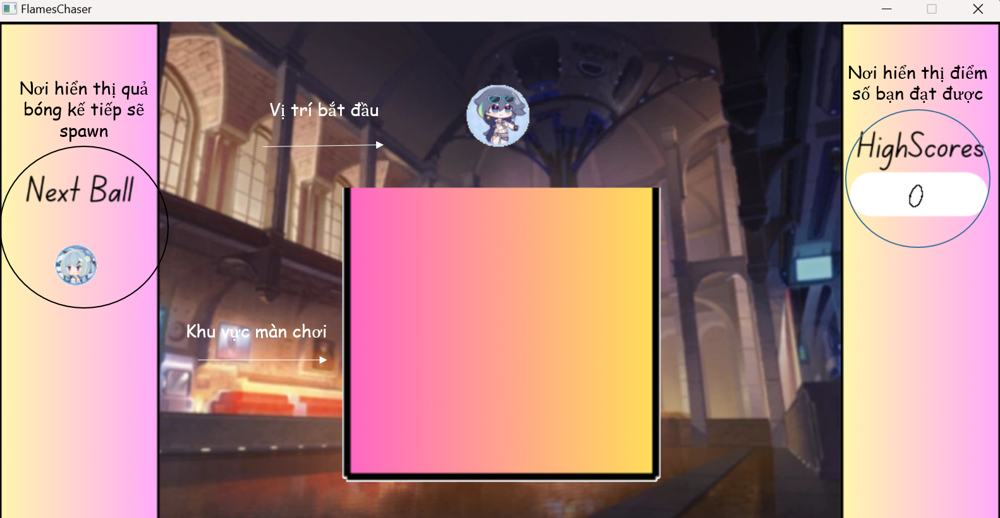
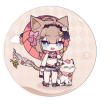
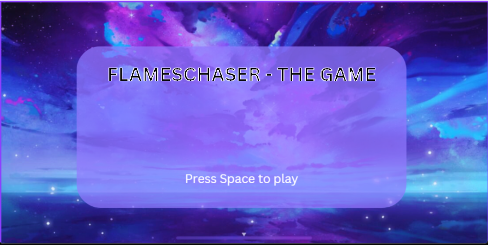
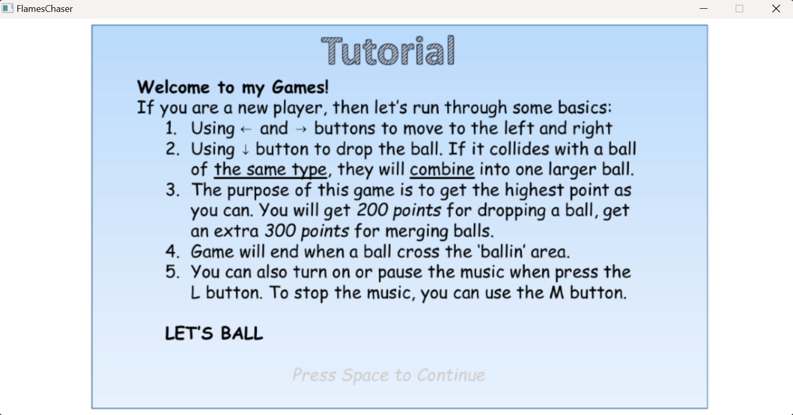
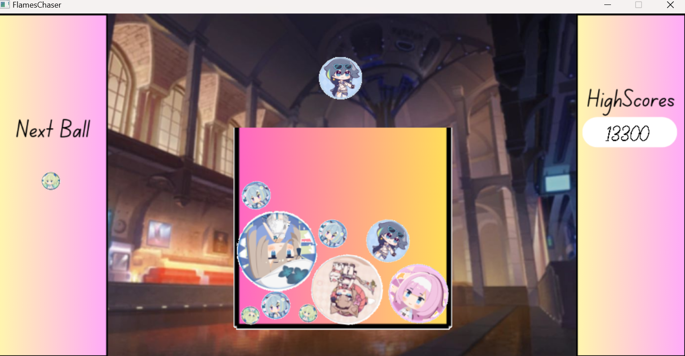
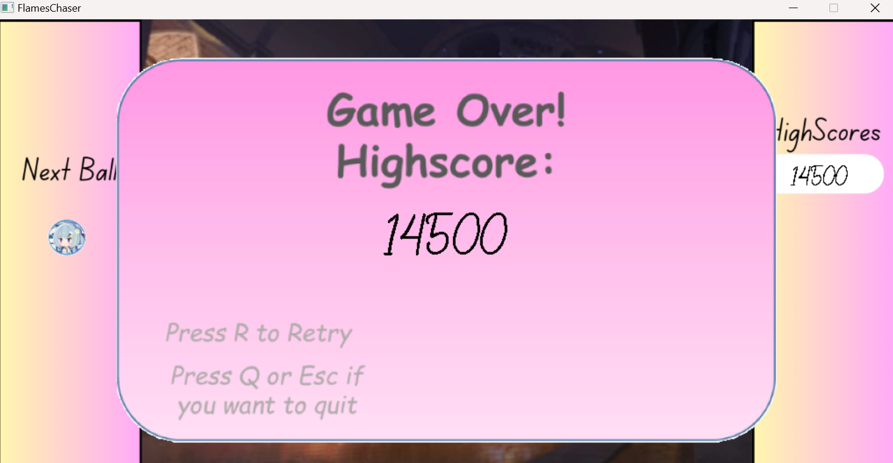

# **Introduction**
Họ và Tên: Lê Đức Minh		- Lớp: K68J

MSSV: 23020683

Game: FlameChasers Game.

# **FlameChasers Game - A new kind of 2048 Game**

## Video demo game và giới thiệu về source code: <https://youtu.be/jsCDNLsGk6Y>

# Giới thiệu Game
Flame Chasers Game là một tựa game thuộc thể loại của 2048, nhưng với những nét mới lạ hơn. Thay vì những con số và những hình vuông nhàm chán, Flame Chasers Game sẽ mang đến những khối tròn với đa dạng màu sắc, với mong muốn đem lại những trải nghiệm tuyệt vời, đặc sắc hơn. Mục tiêu của trò chơi là tìm cách hợp nhất càng nhiều quả bóng với nhau càng tốt để đạt được điểm số cao nhất. Chỉ 2 quả bóng giống nhau mới có thể hợp nhất lại. 

# I. Cách tải game:
	#Lưu ý: Do có cả source code nên cần cài đặt mingw và thư viện SDL2.
- Nếu không cần xem code thì mọi người có thể tải file FlameChasers.zip (~ 28Mb), extract và chạy file FlameChasers.exe để vào game. \
<https://github.com/MinhLee102/Flameschaser/releases/tag/release>

- Mọi người có thể clone repo này về máy tính hoặc tải về file Source_Code.zip. Sau đó chạy file FlameChasers.exe để vào trò chơi.
- Nếu muốn xem source code thì có thể vào các file .cpp hoặc dùng CodeBlocks và click vào FlameChasers.cbp để mở Project. 

# II. Những thành phần cơ bản 

# III. Cách chơi
- Lối chơi của game khá đơn giản. Bạn chỉ cần tìm chỗ để thả những quả bóng một cách hợp lý sao cho điểm số của bạn đạt được cao nhất có thể. 
- Cơ chế chơi tương đồng với 2048, khi 2 quả bóng giống nhau va chạm, chúng sẽ hợp nhất thành một quả có bán kính lớn hơn kế tiếp, cũng giống như gộp 2 số giống nhau thành tổng của chúng. 
- Mỗi khi thả một quả bóng, bạn được cộng 200đ; Khi hợp 2 quả bóng, bạn được cộng thêm 300đ. 
- Trong lúc chơi, bạn cũng có thể lắng nghe những âm thanh piano du dương, thư thái. 
- Game sẽ hiển thị màn hình Game Over cùng với điểm số bạn đã đạt được trong lần chơi khi một trong số những quả bóng đã vượt quá vạch kẻ trên màn chơi trong một khoảng thời gian nhất định.

## **1. Những quả bóng trong game**
- Hình ảnh trên những quả bóng trong trò chơi lấy ý tưởng từ những nhân vật trong tựa game Honkai Impact 3rd. 
- Tổng cộng có 7 loại bóng: 
 
a. Mobius - Bán kính: 20 pixels --------

b. Griseo - Bán kính: 30 pixels ---------

c. Fu Hua - Bán kính: 40 pixels ---------
 

d. Elysia - Bán kính: 50 pixels -----------
 

e. Pardo - Bán kính: 55 pixels -----------

f. Aponia - Bán kính: 60 pixels ----------
 

g. Eden - Bán kính: 65 pixels ------------

 - Quả thứ 7 sẽ là loại cuối và kể cả khi có va chạm với một quả nữa cùng loại thì cũng sẽ không kết hợp được
- Người chơi chỉ có thể thả 1 trong 3 loại bóng đầu tiên.

## **2. Những thao tác trong game**
- Khi khởi động trò chơi, bạn sẽ đến màn hình bắt đầu trò chơi. Bạn chỉ cần nhấn nút Space để đến phần tiếp theo. \

- Sau khi nhấn Space, chúng ta sẽ đến với phần hướng dẫn chơi. Ở đây, sau khi đọc xong, bạn cũng chỉ cần nhấn tiếp nút Space để có thể bắt đầu chơi. \

- Tại màn chơi, bạn có thể điều khiển quả bóng sang trái hoặc sang phải bằng các phím điều hướng  ←  hoặc →. 
- Khi đến vị trí bạn muốn, nhấn phím điều hướng ↓ để thả bóng.
Game sẽ hiển thị quả bóng kế tiếp được xuất hiện ở bên trái màn hình. Bên phải sẽ là nơi hiển thị điểm số bạn đạt được. \

- Bạn có thể dùng nút L để bật nhạc nền. Nhấn nút L lần nữa để tạm dừng nhạc và nút M để dừng hẳn nhạc

- Khi vượt quá vạch kẻ trắng trên màn hình, màn hình Game Over sẽ xuất hiện. Tại đây, bạn có thể chọn chơi lại bằng cách nhấn nút R hoặc thoát ra bằng cách nhấn nút Q hoặc Esc. \
 

# IV. Về đồ họa game
- Do được lấy ý tưởng từ tựa game Honkai impact 3 rd nên nhiều ảnh được lấy từ đó, nguồn chủ yếu từ fanpage chính thức của game và từ hoyolab.
- Phần khung giới hạn của màn chơi, menu và màn hình game over được thiết kế trên canva.

# V. Về source code
- Main:
    + Chứa hàm init để khởi động chương trình, hàm loadMedia để load ảnh và close để đóng và giải phóng bộ nhớ khi kết thúc chương trình.
    + Sử dụng các hàm từ những file khác để thực thi chương trình. 
- GameLib:
    + Đây là các file include những thư viện được sử dụng trong game như iostream, SDL2, SDL2_image, …
    + Chứa hàm tính toán điểm số mà người chơi đạt được xuyên suốt trò chơi
- Game screen: 
    + Quản lý chủ yếu về phần render những thành phần chính của game lên màn hình, bao gồm menu, tutorial, background, màn chơi, và màn hình Game over. 
- Game Object: 
    + Quản lý chủ yếu về phần render những quả bóng xuất hiện trong suốt màn chơi
- moveBalls:
    + Chứa những hàm logic chính của game: nhận tín hiệu được đưa vào từ bàn phím để di chuyển quả bóng, xử lý va chạm giữa những quả bóng, xử lý điều kiện kết thúc game.
- Menu:
    + Chứa hàm để in ra màn hình menu và nhận vào tín hiệu nhập từ bàn phím để vào màn chơi
    + Chứa hàm để in ra màn hình tutorial.
- GameOver:
    + Chứa hàm để in ra màn hình game over khi có một điều kiện nhất định 

# VI. Tổng Kết
## 1. Các kĩ thuật sử dụng
- Gồm các kỹ thuật lập trình cơ bản: vòng lặp, cấu trúc rẽ nhánh, mảng, …
- Sử dụng con trỏ, set.
- Tạo class để quản lý các thành phần của game, chia thành các file header, .cpp.
- Sử dụng sinh số ngẫu nhiên để tạo những loại bóng ngẫu nhiên
- Sử dụng các công thức vật lý, toán học trong hệ tọa độ Oxy để xử lý va chạm.
- Kỹ thuật giải phóng bộ nhớ động
## Nguồn tham khảo - Reference list
- Học về SDL2 \
Lazy Foo’s Production, SDL Tutorials, first viewed March 10th, 
<https://lazyfoo.net/tutorials/SDL/index.php>

- Dùng để tra chức năng các hàm có sẵn của SDL2. \
SDL Wiki, first viewed March 10th 2024, <https://wiki.libsdl.org/SDL2/CategoryAPI>

- Tham khảo về cách xử lý va chạm giữa những quả bóng \
Code for Suika game in Python - Ryan Thomas, orb.py, first viewed April 14th, <https://github.com/crysy-rThomas/SuikaGame/tree/main>

- Tài liệu tham khảo về xử lý va chạm \
C/C++ Program Code for 2D Elastic and Inelastic Collision of 2 Balls, first viewed April 3rd, <https://www.plasmaphysics.org.uk/programs/coll2d_cpp.htm>

- Tạo sprite sheet gồm 7 loại bóng \
Image to Sprite Sheet Generator, first viewed March 15th, <https://codeshack.io/images-sprite-sheet-generator/>

- Hiệu ứng âm thanh khi hợp 2 quả bóng \
	Free Pop Sound Effect, first viewed April 24th, \
<https://mixkit.co/free-sound-effects/pop/>

- Tiếng Piano ở background \
		Jul - Scott Buckley, first viewed April 24th, 
<https://hypeddit.com/track/xf53hv>

## Điều đã học được
- Biết cách để chia chương trình thành các file header, .cpp để dễ dàng quản lý chỉnh sửa, tái sử dụng.
- Hiểu về cơ bản những quy trình để làm ra một tựa game nói riêng và một sản phẩm lập trình nói chung
- Biết cách dùng GitHub
- Phát triển tư duy khi tiếp cận, giải quyết một vấn đề, một bài toán
## Hướng phát triển cho game
- Tối ưu hoá và hoàn thiện phần xử lý va chạm của game
- Thêm những quả bóng đặc biệt với những chức năng khác nhau
- Lưu kết quả highscore sau mỗi lần chơi
- Thêm những màn chơi với khung màn chơi khác nhau.

# VII. Kết luận 
Qua quá trình làm bài tập lớn, mình đã học hỏi được rất nhiều điều về kỹ năng lập trình, lối suy nghĩ, tư duy khi giải quyết vấn đề. Tuy project còn nhiều điều bất cập như chia file còn lộn xộn, xử lý va chạm vẫn còn chưa tối ưu, chưa ổn định, … Nhưng nó đã đem lại cho mình những trải nghiệm mới mẻ, thú vị, bổ ích. 

Em xin được cảm ơn thầy Lê Đức Trọng, thầy Trần Trường Thủy, Anh Phan Anh Tú, cũng như các bạn lớp K68J đã giúp đỡ, hỗ trợ mình trong suốt quá trình làm ra trò chơi này!

